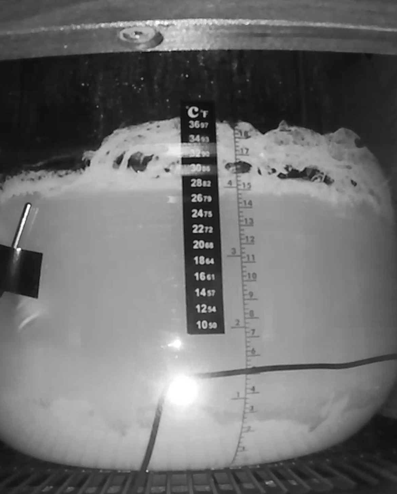
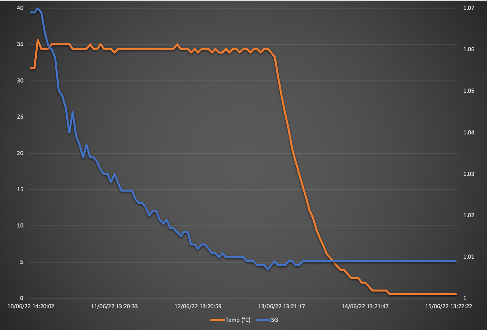
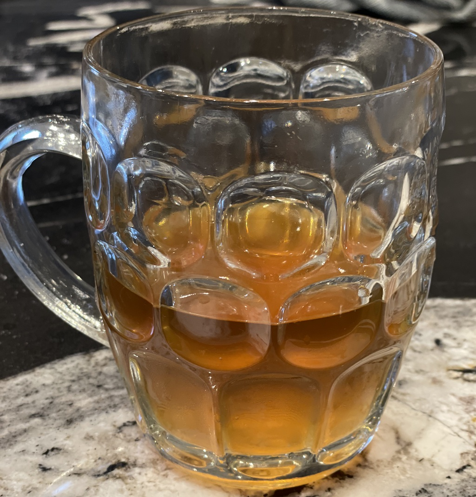

# Wim The Viking

Yup, the label is slowly being simplified.

Belgium Triple as per [Wim The Third](/Wim-the-Third/) but using a Norwegian rather than Belgian yeast.
This is an experiment to work out the pros and cons of this yeast.

## Ingredients

For a 15 litre batch, as at [Malt Miller](https://www.themaltmiller.co.uk/rg/?id=272902)

| Grain                          | Quantity |
| ------------------------------ | -------- |
| Simpsons extra pale malt       | 3000g    |
| Crisp Vienna malt              | 500g     |
| Crisp light Munich malt        | 500g     |
| TMM Jumbo oat flakes           | 500g     |

Water calculations as per [Grainfather](https://shop.grainfather.com/brewing-calculators)
* Mash water: 22 litres
* Sparge water: 0.5 litre
It actually recommends a much larger sparge to mash ratio, but I don't need it as my equipment constantly sparges.

| Additions                              | Quantity | Time         |
| -------------------------------------- | -------- | ------------ |
| Lipohop                                | 2g       | Start        |
| Saaz Hops                              | 10g      | Start        |
| Blegian candie sugar (clear)           | 500g     | 30           |
| Saaz hops                              | 10g      | 10           |
| Irish Moss (rehydrated)                | 5g       | 10           |
| Servomyces Yeast Nutrient              | 1x       | 5            |
| Clarity Ferm                           | 3ml      | Fermentation |
| Lallemand Voss Kveik  Yeast            | 11g      | Fermentation |

Clarity ferm calculations from [Yeastman](https://yeastman.com/calculator)

## Estimates

From [brewers friend](https://www.brewersfriend.com)

| OG    | FG    | Calories     | Carbs         | ABV  | IBU  | SRM  |
| ----- | ----- | ------------ | ------------- |---- | ---- | ---- |
| 1.069 | 1.010 | 225 per 330ml | 18.1 per 330ml | 7.7% | 8   | 13.2   |

The [BJCP SRM guide](https://www.brewersfriend.com/2017/05/07/beer-styles-srm-color-chart-2017-update/) suggests my colour we be closer to a double than a triple, but as long as it tasted nice then I don't really  care.

## Process
* Stnadard mash with a 60 minute boil.
* The main difference is that I used a hop spider to control the hops, and decanted to the fermenter via the tap rather than pump as an attempt to reduce the haze.

## Fermentation

* Clarify ferm was pitched to help remove gluten haze.
* Kveik yeast was pitched at 35C then the fridge was used to maintain 35C during fermentation.
* After the target FG was reached and fermentation slowed I dropped the temperate to 2C for a few days to cold crash
* Fermenting was aggressive:

* (and yes, I now have a beer cam to keep an eye on it)

## Actual figures

| Field       | Target        | Actual |
| ----------- | ------------- | ------ |
| OG          | 1.069         |1.069   |
| FG          | 1.010         |1.009   |
| ABV         | 7.7%          | 7.9%   |

An acceptable variation.

## Graph

## Kegging
The Kveik produces a massive krausen. Although some sunk during the cold crash, some was stubborn. A massive amount clung to the tilt hydrometer making it give wrong gravity readings. I had to place the siphon carefully to avoid any yeastbergs.

4 bottles were filled and the rest went in a keg.

## Tasting notes
It tastes nice, strong, fruity.

This confirms that a lot of the flavour profile comes from the yeast. Despite being the same recipe (apart from the yeast) as my previous Belgian triple, this does not have the Belgian flavour at ll. Instead it tastes slightly fruity, as the kveik yeast is known to cause. It's a nice beer, but not belgian. And for some reason it lacks a head.

## Lessons learnt
* Constant sparging means I don't need to bother rinsing the malt after the mash out.
* Kveik works quickly. The Internet suggests that I don't need to worry about diacetyl rest.
* Kveik turns the beer rather cloudy. It need a long cold crash to make it look attractive.
* Kveik produces a massive krausen. If it doesn't all sink during the cold crash I would love to protect the siphon with a hop spider but it doesn't fit in the fermenter. I'll need a plan B for removing fruit residue from beers...
* By making a bit extra I wasn't worried about getting every last drop from the fermenter, and so inevitably getting too much yeast coming alone with it.
* Don't label when the beer is too cold, the condensation affects the glue.
* Don't cold crash to 1C, ice forms making the beer stronger, and who wants that?
